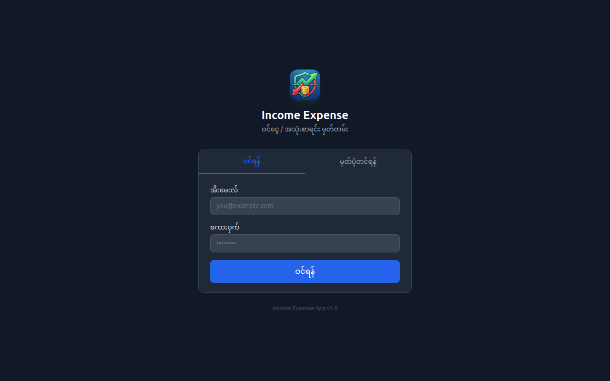
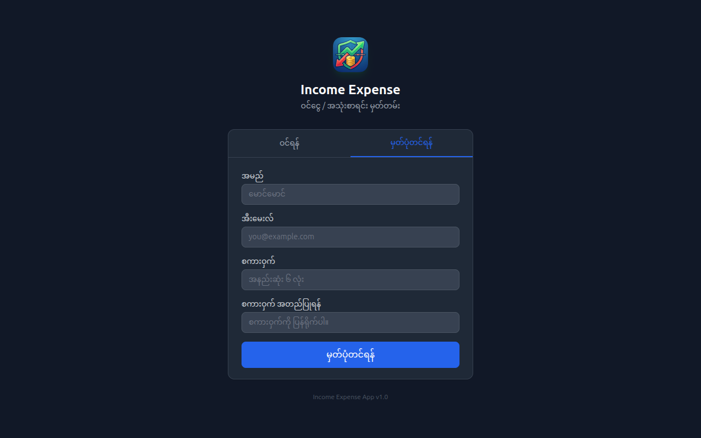
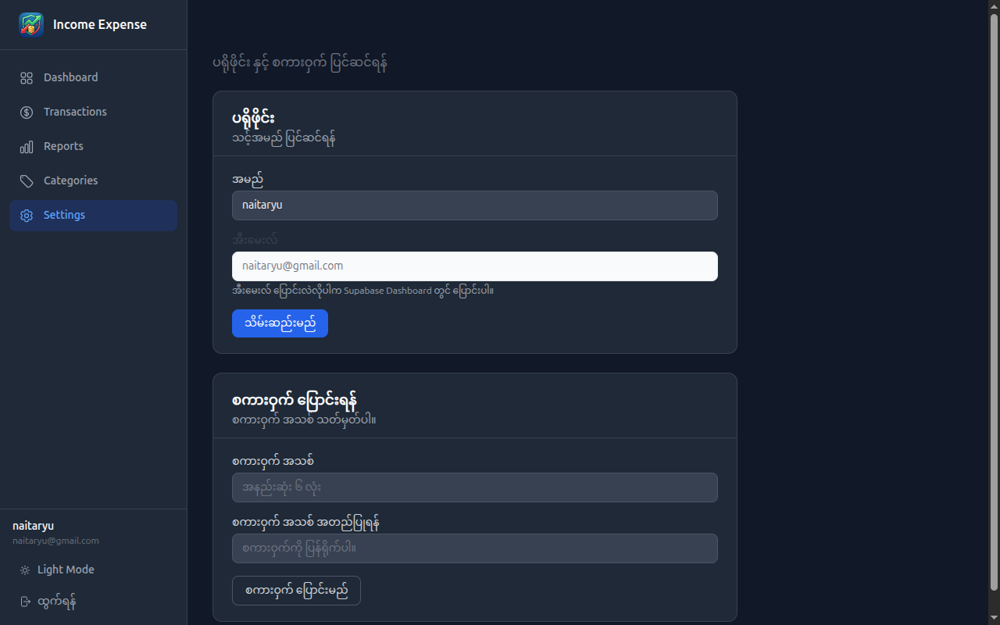

# 💰 ဝင်ငွေ / ထွက်ငွေ စီမံခန့်ခွဲမှု App

[mmbalance app web site link](https://mmbalance.vercel.app/)

မြန်မာကျပ်ငွေ (MMK) ဖြင့် ဝင်ငွေ/ထွက်ငွေ မှတ်တမ်းတင်ပြီး  မိမိ၏ဝင်ငွေကို စီမံခန့်ခွဲနိုင်ပါသည်။
Track your income and expenses in MMK to effectively manage your personal finances.

**next feature**
- mobile app
- AI Financial Advisor ၏ မြန်မာဘာသာ insight တွေ ရယူနိုင်သော web application
  

---

## ✨ Features

- 💰 **Transaction CRUD** — ဝင်ငွေ/ထွက်ငွေ ထည့်၊ ပြင်၊ ဖျက်
- 📊 **Dashboard Charts** — Monthly bar chart + Category pie chart (Recharts)
- 🤖 **AI Financial Advisor** — မြန်မာဘာသာဖြင့် spending insight + saving suggestions
- 🔐 **Supabase Auth** — Email/password + Google OAuth
- 🗂️ **Category Management** — သီးသန့် category တွေ ဆောက်နိုင်
- 📁 **Monthly Reports** — ယမန်လတွေနဲ့ နှိုင်းယှဉ်ကြည့်နိုင်
- 📤 **CSV Export** — Excel မှာ ဆက်သုံးနိုင်
- 🔒 **Row Level Security** — မိမိ data ကိုသာ access ရသည်

---

## Screenshots







---

| File | Page | Viewport | URL | Status |
|------|------|----------|-----|--------|
| `/screenshots/dashboard.png` | Dashboard | 1280×800 | `/` | ✅ |
| `/screenshots/transactions.png` | Transactions | 1280×800 | `/transactions` | ✅ |
| `/screenshots/reports.png` | Reports | 1280×800 | `/reports` | ✅ |
| `/screenshots/categories.png` | Categories | 1280×800 | `/categories` | ✅ |
| `/screenshots/settings.png` | Settings | 1280×800 | `/settings` | ✅ |
| `/screenshots/login.png` | Login | 1280×800 | `/login` | ✅ |
| `/screenshots/register.png` | Register | 1280×800 | `/login` | ✅ |


---
## User Guide 

### [User Guide Link](./userguide.html)
### [PDF Download Link](./userguide.pdf)

---
## 🛠️ Tech Stack

| Category | Tool |
|---|---|
| Frontend | React 18 + Vite |
| Routing | React Router v6 |
| Styling | Tailwind CSS |
| Charts | Recharts |
| Forms | React Hook Form |
| Database | Supabase (PostgreSQL) |
| Auth | Supabase Auth |
| AI Coding | Claude Code + MCP |
| AI Feature | Anthropic API (claude-sonnet-4-6) |

---

## 🚀 Getting Started

### Prerequisites
- Node.js 18+
- Supabase account
- Anthropic API key (AI Advisor feature အတွက်)

### 1. Clone & Install

```bash
git clone https://github.com/your-username/income-expense-app.git
cd income-expense-app
npm install
```

### 2. Supabase Setup

[supabase.com](https://supabase.com) တွင် project တစ်ခု create လုပ်ပြီး  
SQL Editor မှာ ဒီ schema run ပါ —

```sql
-- Categories
CREATE TABLE categories (
  id         UUID PRIMARY KEY DEFAULT gen_random_uuid(),
  user_id    UUID REFERENCES auth.users(id),
  name       TEXT NOT NULL,
  type       TEXT CHECK (type IN ('income','expense')),
  color      TEXT,
  created_at TIMESTAMPTZ DEFAULT NOW()
);

-- Transactions
CREATE TABLE transactions (
  id          UUID PRIMARY KEY DEFAULT gen_random_uuid(),
  user_id     UUID REFERENCES auth.users(id),
  category_id UUID REFERENCES categories(id),
  amount      NUMERIC(12,2) NOT NULL CHECK (amount > 0),
  type        TEXT CHECK (type IN ('income','expense')),
  note        TEXT,
  date        DATE NOT NULL,
  created_at  TIMESTAMPTZ DEFAULT NOW()
);

-- RLS
ALTER TABLE transactions ENABLE ROW LEVEL SECURITY;
ALTER TABLE categories   ENABLE ROW LEVEL SECURITY;

CREATE POLICY "own data only" ON transactions FOR ALL USING (auth.uid() = user_id);
CREATE POLICY "own data only" ON categories   FOR ALL USING (auth.uid() = user_id);
```

### 3. Environment Variables

`.env.local` ဖိုင် create လုပ်ပြီး —

```env
VITE_SUPABASE_URL=https://your-project.supabase.co
VITE_SUPABASE_ANON_KEY=your-anon-key
VITE_ANTHROPIC_API_KEY=your-anthropic-api-key
```

> Keys တွေကို Supabase Dashboard → Project Settings → API မှာ ရနိုင်သည်

### 4. Run

```bash
npm run dev
```

`http://localhost:5173` တွင် ဖွင့်ကြည့်ပါ။

---

## 🤖 Claude Code + MCP Setup

ဤ project သည် **Claude Code** ဖြင့် build လုပ်ထားသည်။

### MCP (Supabase) Connect

```bash
claude mcp add supabase -- npx -y @supabase/mcp-server-supabase@latest \
  --project-ref your-project-ref \
  --access-token your-access-token
```

### Agent Mode နဲ့ Build

```bash
claude --dangerously-skip-permissions
```

### Agents (4)

| Agent | တာဝန် |
|---|---|
| `db-agent` | Supabase schema, queries, hooks |
| `frontend-agent` | Components, pages, routing |
| `validator-agent` | Form validation, error handling |
| `ai-agent` | AI Advisor feature |

### Skills (7)

| Skill | တာဝန် |
|---|---|
| `data-validate` | Validation rules + error messages |
| `supabase-patterns` | Query patterns + auth helpers |
| `format-display` | MMK format + မြန်မာ date |
| `auth-guard` | ProtectedRoute + session |
| `error-handling` | Supabase errors → Myanmar messages |
| `report-logic` | Chart data + calculations |
| `ai-advisor` | Anthropic API + Myanmar prompts |

---

## 📁 Project Structure

```
income-expense-app/
├── .claude/
│   ├── agents/          ← 4 agent files
│   └── skills/          ← 7 skill folders
├── src/
│   ├── components/
│   │   ├── layout/      ← Navbar, Sidebar, ProtectedRoute
│   │   ├── transactions/← List, Form, Filter
│   │   ├── reports/     ← Charts, SummaryCards
│   │   └── ui/          ← Button, Modal, Toast
│   ├── pages/           ← Dashboard, Transactions, Reports, Login
│   ├── hooks/           ← useTransactions, useAIAdvisor...
│   ├── lib/supabase.js  ← Supabase client
│   ├── store/           ← AuthContext, FilterContext
│   └── utils/           ← formatCurrency, validateTransaction
├── CLAUDE.md            ← Claude Code master guide
└── .env.local           ← Keys (git မတင်ရ)
```

---

## 🔐 Security Notes

- `.env.local` → Git push မတင်ရ
- `service_role` key → frontend မသုံးပါနဲ့
- `.claude/settings.json` → Git push မတင်ရ (access token ပါတယ်)
- RLS enabled — user မိမိ data ကိုသာ access ရသည်

---

## 📦 Deploy

```bash
# Build
npm run build

# Netlify — dist/ folder drag & drop
# Vercel
npx vercel
```

---

## 📄 License

MIT