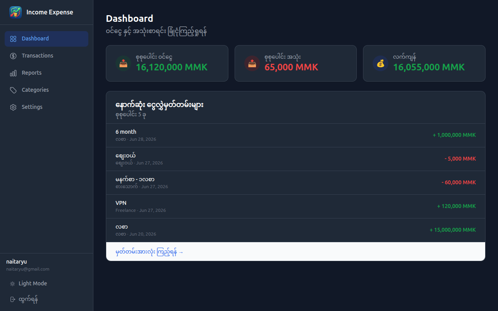
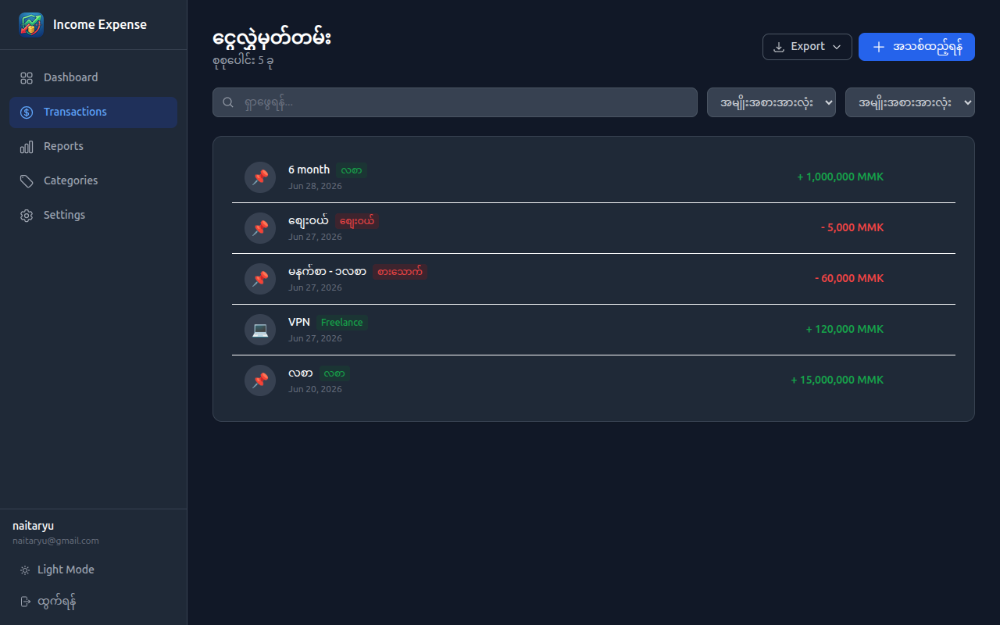
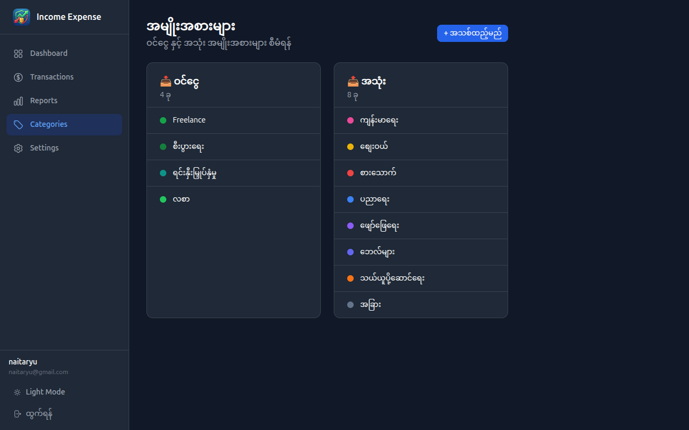
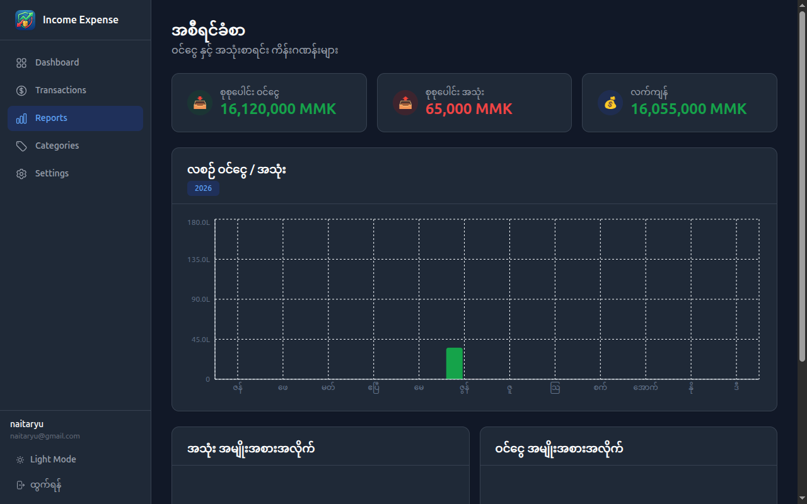

<!--
  Marp template — "terminal-dark"
  Copy this file into your repo (e.g. slides/intro.md) and replace the content.
  Render:  marp slides/intro.md -o slides.html      (or .pdf / .png)
  Theme is self-contained in the <style> block below — no external CSS needed.
-->
---
marp: true
paginate: true
size: 16:9
---

<style>
@import url('https://fonts.googleapis.com/css2?family=JetBrains+Mono:wght@400;500;700&family=Inter:wght@400;600;800&display=swap');
:root {
  --bg:#0d1117; --ink:#e6edf3; --muted:#8b949e;
  --accent:#3fb950; --accent2:#58a6ff; --line:#30363d; --code:#161b22;
}
section {
  background:var(--bg); color:var(--ink);
  font-family:'Inter','Noto Sans','Pyidaungsu',sans-serif;
  font-size:27px; line-height:1.5; padding:56px 72px;
}
h1,h2,h3 { font-family:'JetBrains Mono',monospace; }
h1 { color:var(--accent); font-weight:700; border-bottom:3px solid var(--line); padding-bottom:.2em; }
h2 { color:var(--accent2); font-weight:500; }
h3 { color:var(--ink); }
strong { color:var(--accent); }
a { color:var(--accent2); text-decoration:none; }
code { background:var(--code); color:var(--accent); padding:.06em .35em; border-radius:5px; font-family:'JetBrains Mono',monospace; }
pre  { background:var(--code); border:1px solid var(--line); border-radius:10px; }
pre code { background:none; color:#e6edf3; }
blockquote { border-left:4px solid var(--accent); background:#11161d; color:var(--muted); padding:.5em 1em; }
table th { background:#161b22; color:var(--accent2); }
table td, table th { border-color:var(--line); }
header,footer,section::after { color:var(--muted); font-size:.5em; }
section.cover {
  background:radial-gradient(900px 400px at 80% 12%, rgba(63,185,80,.18), transparent 60%), var(--bg);
}
section.cover h1 { border-bottom:none; font-size:2.3em; }
section.cover .tags code { background:#11161d; color:var(--accent2); margin-right:.4em; }
section.lead { background:#11161d; }
section.lead h1 { border-bottom:none; }
</style>

<!-- _class: cover -->

# project-mmBalance
## Personal Finance Tracker for Myanmar

## one line — Track your income and expenses in MMK to effectively manage your personal finances.

**Your Name** · @naitar

<span class="tags">`#built-with-claude` `#vibecode.tours`</span>

---

# What it is

- A personal finance tracking application
- Manage personal expenses in Myanmar Kyat (MMK)
- Simplify your finances with automated tracking, insightful spending charts, and an AI advisor that understands Myanmar.

---

## Our Idea
#### What We Built
- 💰 Record income & expense in Myanmar Kyat (MMK)
- 📊 Category-based charts & monthly reports
- 🔐 Supabase Auth — email + Google OAuth
- 🤖 AI Financial Advisor — Myanmar language insights
- 📁 Monthly report + CSV export

---

## Architecture
- Claude Code + MCP
- AI Coder Supabase MCP
## How I built it: MCP, Skills, Agents
- **MCP:** Supabase MCP connected, DB schema check directly, Query/insert/migrate.
- **Skills:** data-validate, supabase-patterns, format-display, auth-guard, report-logic, ai-advisor.
- **Agents:** db-agent (DB), frontend-agent (UI), validator-agent (forms), ai-agent (Advisor).

---

# How it works

```bash
# the core flow in 3 commands
npm install
npm run dev
# open http://localhost:3000
```

Stack: **<your stack>** · built with Claude Code

---

<!-- _class: lead -->

# Demo






---

# Links

- **Live:** [https://your-live-url](https://mmbalance.vercel.app/)
- **Repo:** [github.com/you/project](https://github.com/naitar/income-expense-app)
- **License:** MIT